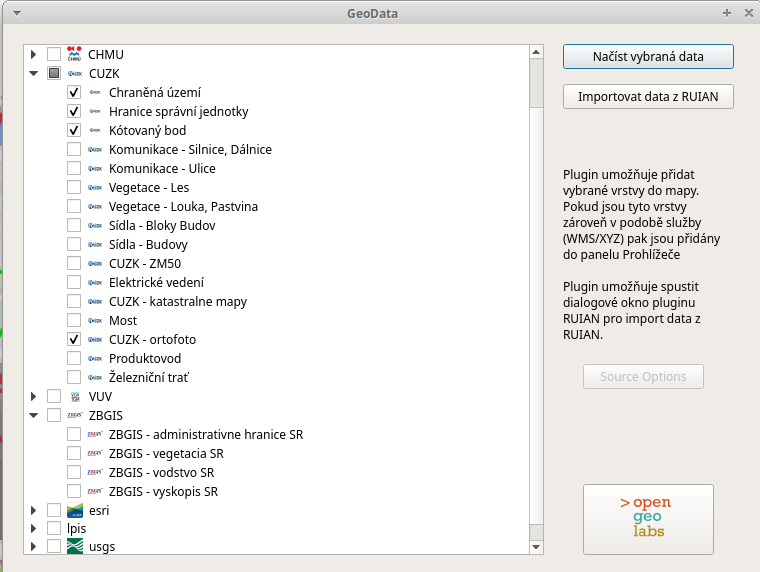
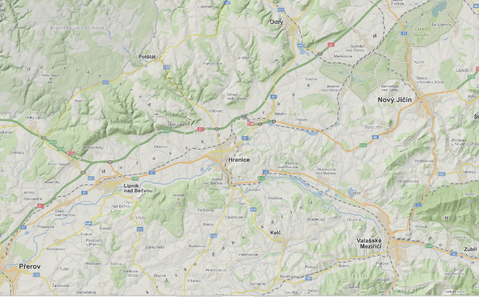

# Free geodata for Czech Republic and Slovakia
Allows to load XYZ/TMS, WMS and geodata that are not published as service.
The focused area is Czech Republic and Slovakia.

## Use it
It is better to have EPSG:5514 as a default CRS set in the QGIS.

### Run it
The dialog is available via button in Plugins toolbar.

### Dialog
Dialog allows to select from sources and load them into the map.

### News
The sources now include mapy.cz and hillshade from DEM 5G. 

 
### Contributors
* https://github.com/tkacovas Stela Tkáčová
* https://github.com/ruz76 Jan Růžička
* https://github.com/ruz02 Kateřina Růžičková
* https://github.com/MichaelaBozonova Michaela Božoňová
* https://github.com/BED0131
* https://github.com/kalab-oto Oto Kaláb
* https://github.com/mic0360
* https://github.com/Hro0082
* https://github.com/GUL0021 Tomáš Gulčík
* https://github.com/hyr0011
* https://github.com/PetoP Peter Piesecký
* https://github.com/jachym Jáchym Čepický
* https://github.com/landam Martin Landa
* https://github.com/jakubsimek97 Jakub Šimek
* https://github.com/Bambooojooo Jan Kučera
* Miki Michalko
